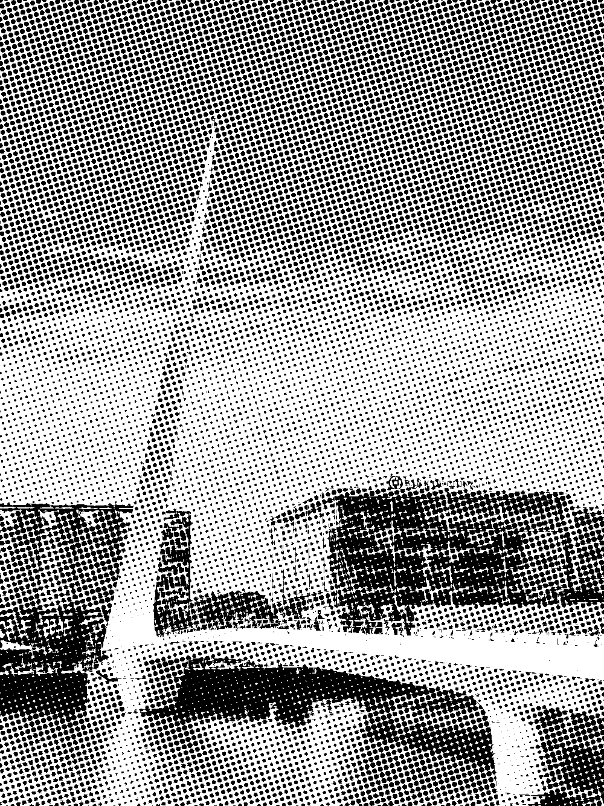
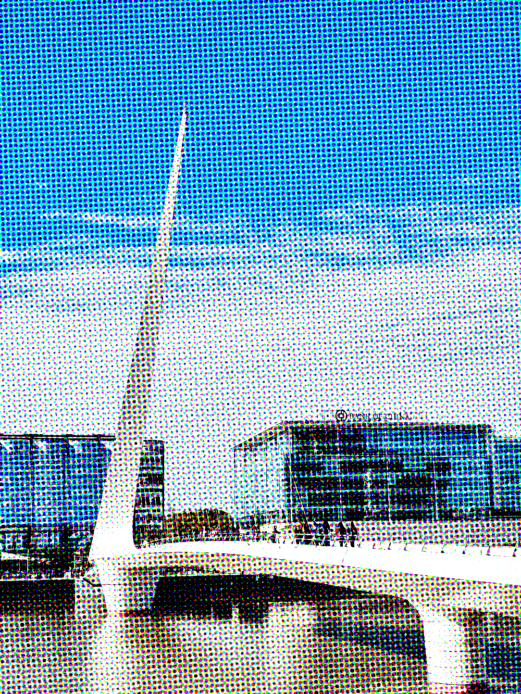
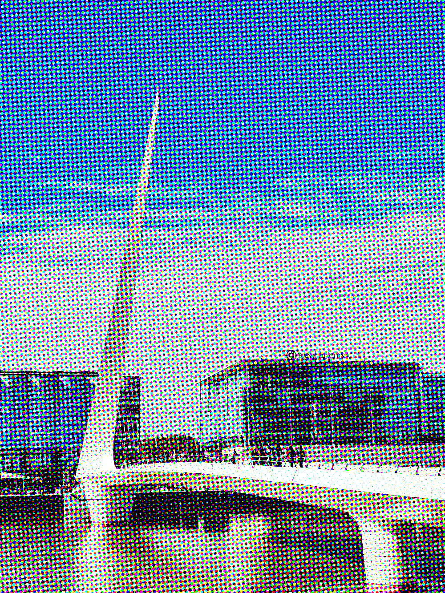
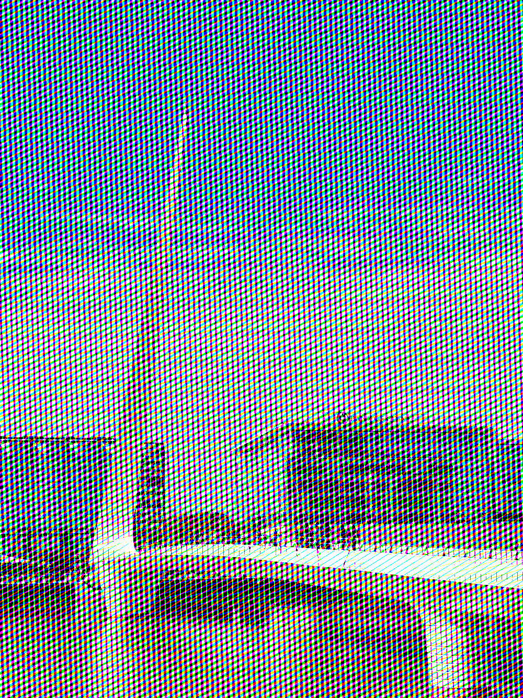
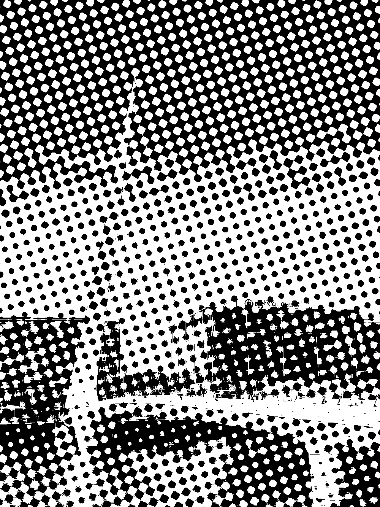
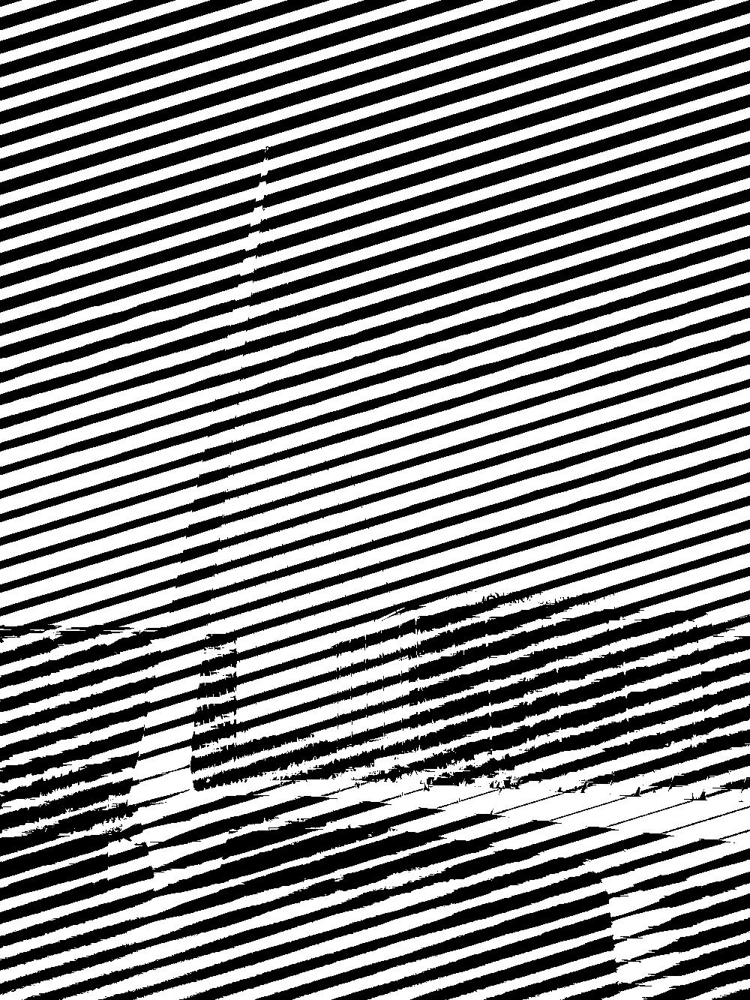
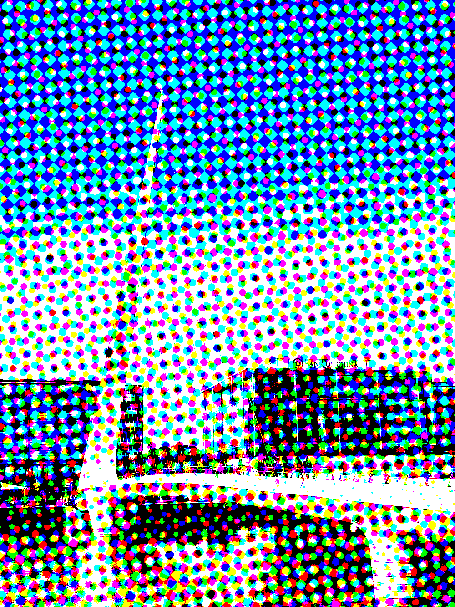
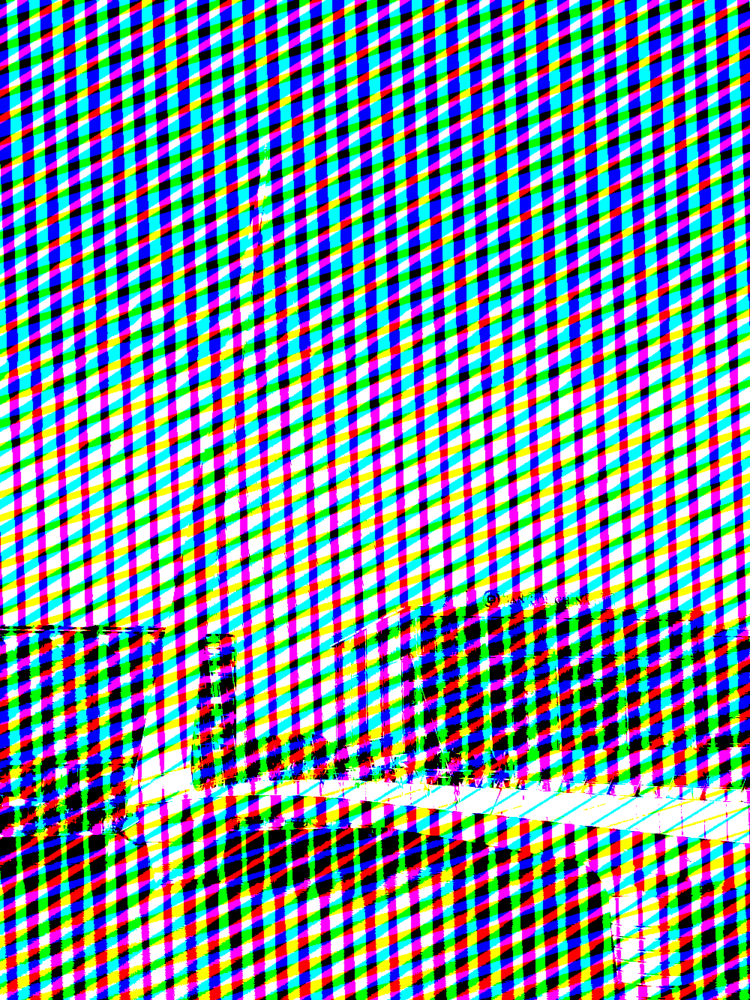
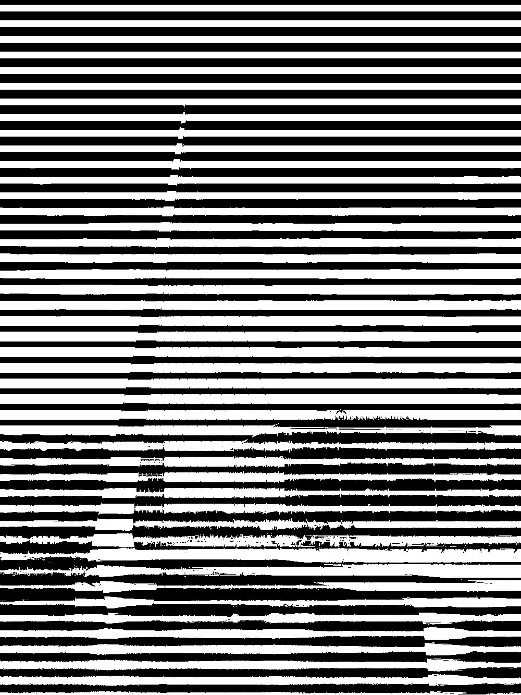

# Galería de Muestras

Este documento muestra los resultados generados por el script `create-examples.sh` con el parámetro de ángulo configurado en **17 grados**.

## Parámetros Generales
- **Imagen de entrada:** `puente.jpg`
- **Brillo:** 10
- **Contraste:** 1

## Muestras Generadas

| Archivo | Escala | Forma | Color | Visualización |
|---|---|---|---|---|
| `example-1.png` | 10 | Round | No |  |
| `example-2.png` | 10 | Euclidean | No |  |
| `example-3.png` | 10 | Line | No |  |
| `example-4.png` | 10 | Round | Sí |  |
| `example-5.png` | 10 | Euclidean | Sí |  |
| `example-6.png` | 10 | Line | Sí |  |
| `example-7.png` | 30 | Round | No |  |
| `example-8.png` | 30 | Euclidean | No |  |
| `example-9.png` | 30 | Line | No |  |
| `example-10.png` | 30 | Round | Sí |  |
| `example-11.png` | 30 | Euclidean | Sí |  |
| `example-12.png` | 30 | Line | Sí |  |

## Verificación de Ángulo
Para verificar que 0 grados corresponde a líneas horizontales:

| Archivo | Ángulo | Forma | Visualización |
|---|---|---|---|
| `test_angle_0.png` | 0 | Line |  |
